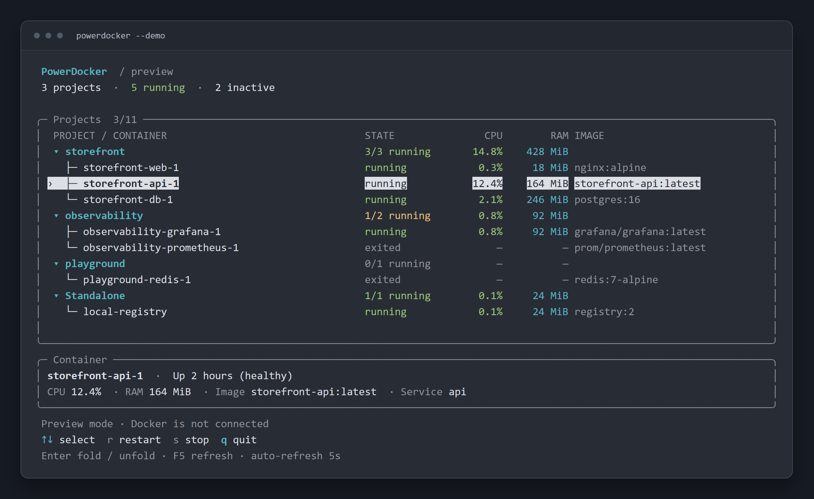

# PowerDocker

A simple Docker container management tool built with .NET and [Spectre.Console](https://spectreconsole.net), with Docker Compose project grouping.



## Elevator Pitch

* Docker Desktop is a slow and awkward experience. 
* Lazydocker can't organize containers into projects.
* **PowerDocker** is fast and extremely simple. Start or stop your containers or projects with one keystroke.

## Features

- **Simple Text-based UI**: Project tree, aligned state columns, running counts, and a selection detail panel. Wide terminals also show container images.
- **Compose Project Grouping**: Automatically groups containers by their Docker Compose projects
- **Native app**: No Electron, no web browser, no Node.js, no JavaScript.
- **Keyboard Shortcuts**: Fast control with simple key commands (r=start/restart, s=stop, q/e=exit)
- **Auto-refresh**: Updates every 5 seconds, preserving the selected container even when rows change order
- **Collapsible Projects**: Fold or unfold a project with Enter or Space
- **Preview Mode**: Try the interface with `powerdocker --demo`, without connecting to Docker
- **Standalone Container Support**: Shows non-compose containers under "Standalone" group

## Installation

### Prerequisites

1. Install .NET 8.0 or later
2. Configure Docker permissions (Linux only):
   ```bash
   sudo usermod -aG docker $USER
   # Log out and back in, or restart your session
   ```

### Install PowerDocker

#### Option 1: Install Globally As Dotnet Tool (recommended)

```bash
# Clone
git clone https://github.com/MichalSkoula/powerdocker.git
cd powerdocker

# Install as global tool (optional)
dotnet pack -c Release
dotnet tool install --global --add-source ./bin/Release PowerDocker

# Run from anywhere
powerdocker
```

#### Option 2: Clone and Build from Source

```bash
# Clone the repository
git clone https://github.com/MichalSkoula/powerdocker.git
cd powerdocker

# Build the application
dotnet build

# Run the application
dotnet run

# Preview the interface without Docker
dotnet run -- --demo
```

#### Option 3: Create Standalone Executable

```bash
# Clone the repository
git clone https://github.com/MichalSkoula/powerdocker.git
cd powerdocker

# Create self-contained executable
dotnet publish -c Release -r linux-x64 --self-contained -p:PublishSingleFile=true -o ./publish

# Run the standalone executable
./publish/PowerDocker
```

Replace `linux-x64` with your platform:
- Windows: `win-x64`
- macOS: `osx-x64` or `osx-arm64` (Apple Silicon)
- Linux: `linux-x64` or `linux-arm64`

## Controls

| Key | Action |
| --- | --- |
| ↑ / ↓ or k / j | Select a project or container |
| Home / End, Page Up / Page Down | Navigate long lists |
| Enter / Space | Fold or unfold the selected project |
| r | Start an inactive selection, or restart a running selection |
| s | Stop the selection |
| F5 | Refresh now |
| q / e / Esc / Ctrl+C | Quit and restore the previous terminal screen |

Selecting a project applies start/restart/stop to all existing containers in that group. The Standalone group behaves the same way. These actions operate on containers through the Docker API; they do not run `docker compose up` or create missing containers.

Docker actions are disabled in preview mode. During a Docker action, navigation remains available and additional actions are disabled until it finishes.

## Development checks

```bash
dotnet build
dotnet run --project tests/PowerDocker.Checks.csproj
```

The checks cover selection preservation, collapsing and scrolling, empty hosts, small terminals, literal Docker metadata, and ANSI output that leaves the terminal background untouched.
